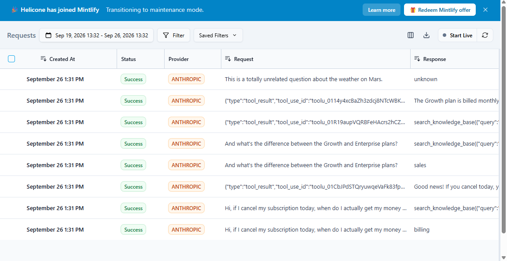

# Claude Agent Orchestrator

[](https://github.com/rafabslu-1986/claude-agent-orchestrator/actions/workflows/tests.yml)

A multi-agent orchestration framework built directly on the Claude API — no no-code layer in between. It routes an inbound message to the right specialist, grounds every policy-level answer in a real knowledge base through native tool use, and hands off to a human the moment an agent isn't confident.

This generalizes the routing/handoff pattern from a production WhatsApp + Instagram customer service system I built and run for a travel agency, rewritten here as a reusable, client-agnostic framework so the architecture itself — not one company's data — is what's on display.

## What it does

1. **Routes** an inbound message to one of three specialists (`sales`, `support`, `billing`) using a single, cheap Claude classification call. Anything it can't confidently classify goes straight to `unknown` instead of being guessed at.
2. **Answers** using a specialist agent configured with the **FPCL prompt framework** — Role, Context, Limits, Format — so every agent's behavior is defined by four short, auditable sections instead of one long free-form prompt.
3. **Grounds** policy answers (prices, refund timelines, shipping windows) in a local knowledge base via Claude's native tool use, instead of letting the model answer from assumptions.
4. **Escalates** to a human, with a logged reason, whenever a specialist calls the `escalate_to_human` tool — the same fallback the production system uses on the human-handoff step.
5. **Remembers** the conversation across turns per session, so a specialist sees the full thread, not just the latest message.

## Architecture

```
inbound message
│
▼
Router (1 Claude call, no tools)
│
├── sales / support / billing ──▶ Specialist agent
│ │
│ ┌────────────┴────────────┐
│ ▼ ▼
│ search_knowledge_base escalate_to_human
│ (BM25 over local docs) (flags for a human)
│ │
│ ▼
│ grounded final answer
│
└── unknown ──▶ escalate_to_human directly
```

Every arrow above is a real function call in this repo, not a diagram aspiration — see `src/orchestrator/orchestrator.py` for the whole pipeline in about 40 lines.

## Why BM25 instead of an embeddings API

The retrieval layer (`rag.py`) uses BM25 (lexical ranking, via the tiny `rank_bm25` package) over local markdown files, not an embeddings API. That's a scope decision, not an architectural limitation: `KnowledgeBase.search(query, top_k)` is the only interface the rest of the code depends on, so swapping in a real vector database (pgvector, Pinecone, etc.) with embeddings is a one-file change — nothing in the router, agents, or orchestrator needs to know. Keeping it lexical means the whole project installs, runs, and tests fully offline with no external API cost. It started as TF-IDF + cosine similarity; see "RAG avançado (Etapa 10)" below for why it's BM25 now, and for the honest limits of lexical retrieval that swapping the ranking algorithm alone doesn't fix.

## Key results

- **42 automated test scenarios, all passing** — routing (including the unknown-intent fallback), RAG retrieval accuracy (including the precision-gate behavior added in Etapa 10), both tools, session memory isolation and LGPD-driven TTL expiry, the PII knowledge-base guardrail, session export/erasure, retry/circuit-breaker behavior against real Anthropic SDK exception types, and 9 full end-to-end pipeline scenarios (grounded answer, direct answer, escalation, multi-turn memory, data export, data erasure, a transient-failure recovery, and the tool-loop giving up gracefully after too many iterations).
- Tests run **fully offline** against a scripted fake Claude client (`tests/conftest.py`) — no API key or network access needed to verify the logic. A separate `examples/demo_conversation.py` script is provided for a live run against the real API.
- The tool-use loop has a hard iteration cap with a graceful escalation fallback, so a specialist that can't converge on an answer degrades to a human handoff instead of hanging or erroring.

## Project layout

```
.github/workflows/tests.yml CI: runs the full suite on push/PR (Etapa 12)
src/orchestrator/
claude_client.py thin wrapper around the Anthropic SDK (the only file that imports it)
prompts.py FPCL system-prompt builder
router.py intent classification
agents.py specialist agents + the shared tool-use loop
rag.py BM25 knowledge base retrieval
tools.py tool schemas + local tool implementations
memory.py per-session conversation state, optional LGPD TTL
privacy.py PII detection (knowledge-base guardrail)
resilience.py retry + circuit breaker for transient API failures (Etapa 13)
orchestrator.py ties it all together, plus LGPD export/erasure
knowledge_base/ sample markdown docs the specialists search against
tests/ 42 scenarios, run offline against a fake client
examples/ live demo script (needs a real API key)
```

## Installation

```bash
git clone https://github.com/rafabslu-1986/claude-agent-orchestrator
cd claude-agent-orchestrator
pip install -r requirements.txt
```

## Running the tests

```bash
pytest tests/ -v
```

No API key needed — every test runs against a scripted fake Claude client.

## Running the live demo

```bash
export ANTHROPIC_API_KEY=sk-ant-...
python examples/demo_conversation.py
```

## Extending it

- **New specialist**: write one new `FPCLPrompt` in `agents.py`, add it to `Orchestrator.specialists`, add its name to `router.INTENTS`.
- **New tool**: add a schema to `TOOL_SCHEMAS` in `tools.py` and a handler method on `ToolExecutor`.
- **Real vector DB**: implement the same `search(query, top_k)` interface as `KnowledgeBase` and swap it in — no other file changes.
- **Persistent memory**: swap the dict in `SessionMemory` for Redis or a database table behind the same `get` / `append` / `clear` interface.

## Observabilidade: custo e latencia (Helicone)

### O problema

Rodar agentes em producao sem visibilidade de custo por conversa e latencia
por chamada e operar no escuro. O primeiro sinal de problema costuma ser a
fatura do fim do mes ou o cliente reclamando de demora, nao um alerta.

### A solucao

Instrumentacao opcional via Helicone, ativada so por uma variavel de
ambiente (`HELICONE_API_KEY`). Sem a variavel, o sistema funciona
exatamente como antes: zero mudanca de comportamento, zero dependencia
nova obrigatoria. Com ela, toda chamada ao Claude passa a ser rastreada:
prompt, resposta, tokens, custo e latencia, por conversa.

A mudanca ficou isolada em um unico arquivo, `claude_client.py`, o unico
ponto do projeto que importa o SDK da Anthropic, sem tocar em router,
agentes, RAG ou memoria.

### Stack tecnica

Helicone (proxy de observabilidade, plano Hobby gratuito) configurado via
parametros padrao do SDK, sem biblioteca adicional.

### Resultado

Testado em uma conversa real de 3 turnos (roteamento sales/billing e
escalonamento humano no caso "unknown"). As 8 chamadas subjacentes
(router, especialistas e tool use) apareceram no dashboard da Helicone com
custo e latencia individuais, sem quebrar nenhum dos 16 testes automatizados
existentes.



## Evals: taxa de acerto do roteamento (Etapa 9)

### O problema

Testes automatizados provam que o codigo funciona (dado input X, a funcao Y
retorna Z), mas nao provam que o agente toma a decisao certa quando a
mensagem e ambigua, mal escrita ou em outro idioma. Sem isso, a unica forma
de saber se o roteador esta bom e observar producao e torcer.

### A solucao

Um eval set com 20 cenarios reais de conversa (`evals/scenarios.py`),
cobrindo os tres intents (`sales`, `support`, `billing`), casos que devem
escalar para humano (`unknown`) e casos de borda deliberados: intent
misturado, mensagem curta, portugues em vez de ingles, e cliente frustrado.
Um runner (`evals/run_evals.py`) manda cada cenario pro orchestrator de
verdade, contra a API real do Claude, e compara o intent e o escalonamento
retornados com o esperado.

Diferente dos 16 testes offline (que usam um cliente Claude falso e
travado), esse eval roda contra o modelo real: mede o comportamento do
sistema em producao, nao so a logica do codigo.

### Stack tecnica

Python puro (`dataclasses`), sem framework de eval. Resultado de cada
rodada salvo em JSON (`evals/results/`, ignorado no git) para comparar
rodadas ao longo do tempo.

### Resultado

20/20 cenarios passaram (100%) na primeira rodada real, incluindo os
quatro casos de borda e o cenario em portugues.

```bash
export ANTHROPIC_API_KEY=sk-ant-...
python evals/run_evals.py
```

## RAG avancado (Etapa 10)

### O problema

O roteamento (Etapa 9) mede se o agente conversa direito. Nada, ate aqui,
media se o proprio retrieval (`rag.py`) busca o pedaco certo da base de
conhecimento -- ou, mais importante, se ele confiantemente devolve um
pedaco errado para uma pergunta que a base simplesmente nao responde.
Retrieval "bom o suficiente" na demonstracao mas silenciosamente errado em
producao e como um RAG alimenta o modelo com contexto que parece relevante
e nao e, o que vira resposta inventada em vez de escalonamento.

### A solucao

Duas mudancas, medidas uma contra a outra em `evals/rag_eval.py`, offline,
sem chave de API:

Primeiro, troquei o ranking de TF-IDF + similaridade de cosseno por BM25
(via `rank_bm25`), que soma saturacao de frequencia de termo e normalizacao
por tamanho do documento -- e removeu duas dependencias pesadas
(scikit-learn, numpy) do projeto. So essa troca, medida, nao resolveu o
problema real: com um eval de 15 perguntas respondiveis + 6 perguntas
propositalmente nao respondiveis pela base (ex.: "voces aceitam quais
moedas de pagamento?", que a base nunca cobre), tanto o TF-IDF antigo
quanto o BM25 novo devolviam, com confianca, algum pedaco da base para
100% das perguntas nao respondiveis -- porque uma unica palavra em comum
("pagamento", "envio") ja basta para pontuar bem em qualquer ranking
lexical, bounded ou nao.

A correcao real foi um segundo gate, opcional e explicito:
`min_token_overlap`, que exige um numero minimo de palavras distintas (nao
apenas uma pontuacao alta) em comum entre a pergunta e o pedaco antes de
confiar nele. Ligado (`min_token_overlap=2`), a taxa de falso-retrieval cai
de 100% para 17%, ao custo de perder 2 das 15 perguntas respondiveis (Hit
Rate@3 cai de 100% para 87%). E uma troca real de precisao por cobertura,
nao uma correcao gratuita -- por isso o gate fica desligado por padrao
(comportamento de hoje preservado) e vira uma escolha explicita de quem
chama `search()`.

### Stack tecnica

`rank_bm25` (puro Python, substitui scikit-learn + numpy). Nenhuma
dependencia nova para o gate de precisao -- e so contagem de conjuntos de
tokens.

### Resultado

| Metrica | Antes (score apenas) | Depois (+ min_token_overlap=2) |
|---|---|---|
| Hit Rate@3 (15 perguntas respondiveis) | 100% | 87% |
| MRR@3 | 1.000 | 0.867 |
| False-Retrieval Rate (6 perguntas nao respondiveis) | 100% | 17% |

```bash
python evals/rag_eval.py
```

## LGPD compliance (Etapa 11)

### O problema

Nada nas Etapas 1-10 tratava as conversas dos clientes como o que elas sao:
dados pessoais sob a LGPD. Tres lacunas concretas, nao teoricas:
retencao indefinida (`SessionMemory` guardava tudo enquanto o processo
estivesse de pe, sem limite), nenhum mecanismo para um cliente pedir seus
dados de volta ou pedir para serem apagados, e -- a mais seria -- a
integracao com Helicone da Etapa 8 encaminhava o prompt e a resposta
completos (ou seja, a mensagem literal do cliente) para um terceiro por
padrao, sem necessidade: o objetivo daquela etapa era custo e latencia, nao
o conteudo da conversa.

### A solucao

Tres mudancas independentes, cada uma testada:

**Retencao (Art. 6, III, necessidade)**: `SessionMemory` agora aceita
`ttl_hours`; mensagens mais velhas que o TTL sao descartadas na proxima
leitura ou escrita daquela sessao. Sem `ttl_hours`, o comportamento de hoje
continua idêntico (nada muda por padrao).

**Direitos do titular (Art. 18)**: `Orchestrator.export_session_data()`
(acesso/portabilidade, incisos II e V) e `Orchestrator.forget_session()`
(eliminacao, inciso VI) -- esse ultimo ja existia um nivel abaixo
(`SessionMemory.clear()`), so nao estava exposto como uma operacao de
verdade no orchestrator.

**Minimizacao com terceiros (Art. 46, seguranca)**: em vez de tentar
redigir o prompt antes de mandar pra Helicone -- o que exigiria redigir o
que o proprio Claude recebe, ja que o Helicone e um proxy no meio do
caminho, nao uma copia ao lado --, a integracao agora manda
`Helicone-Omit-Request`/`Helicone-Omit-Response` por padrao quando
`HELICONE_API_KEY` esta definida. Custo e latencia (o motivo da Etapa 8)
vem dos metadados de uso e do tempo da requisicao, nao do conteudo, entao
nada se perde exceto a capacidade de ler a mensagem do cliente de volta no
dashboard -- que e exatamente o que nao deveria estar la. Um
`HELICONE_LOG_CONTENT=true` explicito reverte isso para debug local.

Como guardrail complementar, `privacy.py` detecta CPF (com digito
verificador de verdade, nao so o formato), email, telefone brasileiro e
cartao (via Luhn) -- validado o suficiente para nao confundir um numero de
pedido de 11 digitos com um CPF invalido, mas ainda assim ambiguo o
bastante para tratar um numero de pedido de 11 digitos como telefone
quando nao ha mais contexto (um teste documenta esse caso de propósito). Um
teste escaneia todo `knowledge_base/*.md` procurando por isso -- a
lacuna real que esse guardrail existe pra pegar e alguem colar um
atendimento real numa doc de politica generica.

### Stack tecnica

Nenhuma dependencia nova. `privacy.py` e regex + os algoritmos reais de
validacao (digito verificador de CPF, Luhn) em Python puro.
`Helicone-Omit-*` sao so headers HTTP que a Helicone ja suporta.

### Resultado

12 testes novos (30 no total): guardrail de PII sobre a base de
conhecimento real (0 falsos positivos, 0 falsos negativos no conjunto
rotulado), TTL de memoria (expira o que deveria, preserva o que nao
deveria), e export/erasure ponta a ponta pelo Orchestrator.

```bash
pytest tests/test_privacy.py tests/test_memory.py -v
```

## CI automatizado (Etapa 12)

### O problema

Ate a Etapa 11, "os 30 testes passam" era uma afirmacao que so valia no
momento em que eu rodava `pytest` no meu proprio ambiente, antes de subir
pro GitHub. Nada garantia que o proximo commit -- meu ou de outra pessoa,
via pull request -- nao quebrava algo silenciosamente; a suite so seria
executada de novo na proxima vez que alguem lembrasse de rodar manualmente.
Pra um projeto publico que serve de portfolio, isso e uma lacuna de
credibilidade: o README pode alegar "30 testes passando", mas nao ha nada
verificavel por fora provando isso a cada mudanca.

### A solucao

Um workflow do GitHub Actions (`.github/workflows/tests.yml`) que roda a
suite inteira a cada push pra `main` e a cada pull request, numa matriz com
Python 3.11 e 3.12 -- pra garantir que o projeto nao depende sem querer de
um detalhe de versao especifica. Como bonus informativo (nao trava o
build), o mesmo workflow tambem roda `evals/rag_eval.py` a cada execucao,
entao a tabela de Hit Rate / MRR / False-Retrieval Rate da Etapa 10 fica
visivel no log de toda run, nao so na hora em que eu rodei manualmente.

Diferente das etapas anteriores, aqui a "prova" nao e um numero que eu
meça e reporte -- e o proprio selo de status do GitHub, que qualquer
visitante do repositorio pode conferir clicando na aba Actions, sem
confiar na minha palavra.

### Stack tecnica

GitHub Actions (`actions/checkout@v4`, `actions/setup-python@v5`), sem
nenhuma dependencia nova no projeto em si -- o workflow so instala o
`requirements.txt` que ja existia.

### Resultado

Primeira execucao (`CI #1`, disparada pelo commit que adiciona o proprio
workflow): os 2 jobs da matriz (3.11 e 3.12) completaram com sucesso em 22s
no total. O badge no topo deste README reflete o status da run mais
recente em tempo real.

```bash
# roda localmente o mesmo comando que o CI roda
pip install -r requirements.txt
pytest -v
```

## Resiliencia: retry + circuit breaker (Etapa 13)

### O problema

Ate a Etapa 12, toda chamada ao Claude (`ClaudeClient.send`) assume que ou
funciona ou falha de vez. Na pratica, uma API remota tem falhas
transitorias -- rate limit (429), timeout de rede, erro 5xx do servidor --
que desaparecem sozinhas se voce tentar de novo meio segundo depois. Sem
tratamento, uma dessas falhas sobe direto ate quem chamou
`handle_message`, derruba o turno inteiro e o cliente perde a mensagem,
mesmo quando o problema durou uma fracao de segundo.

O oposto tambem e um problema: se a API inteira cair por minutos (nao
segundos), simplesmente tentar de novo a cada mensagem so empilha retries
sobre um servico que ja esta fora do ar, sem ganhar nada.

### A solucao

Duas pecas, em `resilience.py`, compostas, sem tocar em `ClaudeClient`:

**Retry com backoff exponencial + jitter**: `is_transient(exc)` classifica
a excecao usando as classes reais do SDK -- `RateLimitError`,
`APITimeoutError`, `APIConnectionError`, `InternalServerError`, e qualquer
`APIStatusError` com status 5xx sao transitorias; um 400 ou 401 nao sao
(retry num request que esta errado nao resolve nada, so atrasa o erro de
verdade). So os erros transitorios sao retentados, com delay
`base_delay * 2**tentativa` (limitado por `max_delay`) e jitter aleatorio,
ate `max_attempts`.

**Circuit breaker**: acumula falhas transitorias consecutivas; ao cruzar
`failure_threshold`, abre e passa a rejeitar chamadas na hora
(`CircuitOpenError`) em vez de deixar o cliente esperar o timeout de rede
de novo a cada mensagem enquanto a API esta fora do ar. Depois de
`recovery_timeout` segundos, libera uma chamada de teste (half-open):
sucesso fecha o circuito, falha reabre.

`ResilientClaudeClient` combina as duas atras da mesma interface
`.send(...)` que o resto do projeto ja usa -- e composicao, nao subclasse,
entao router, agentes e tools nao precisam saber que ela existe. Uso
opcional e desligado por padrao: `Orchestrator(resilient=True)`.

### Stack tecnica

Nenhuma dependencia nova alem do que ja estava implicito
(`httpx`, transitiva do `anthropic`, agora declarada direto no
`requirements.txt` porque os testes constroem excecoes reais do SDK com
ela). Backoff e circuit breaker sao Python puro (`dataclasses`, `enum`,
`time.monotonic`).

### Resultado

11 testes novos cobrindo classificacao de erro (transitorio vs. nao),
retry ate sucesso, desistencia apos `max_attempts`, crescimento exponencial
do delay com teto, e as tres transicoes do circuit breaker (fecha -> abre
-> half-open -> fecha ou reabre) -- tudo deterministico e offline: o
retry recebe uma funcao `sleep` fake que so registra os delays pedidos, e
o circuit breaker recebe um relogio fake que avancamos manualmente, entao
"reabre depois de 30s" e testado sem esperar 30 segundos de verdade. Mais
1 cenario end-to-end provando que `Orchestrator(resilient=True)` sobrevive
a uma falha transitoria bem no primeiro passo do pipeline (a propria
chamada do router).

```bash
pytest tests/test_resilience.py -v
```

## License

MIT
